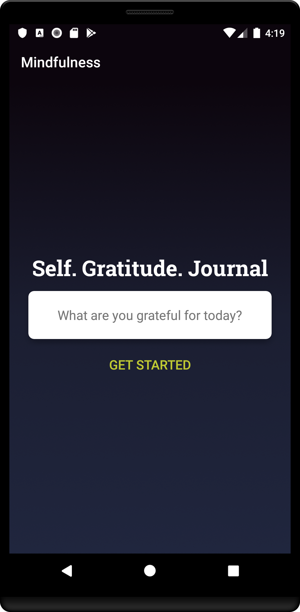
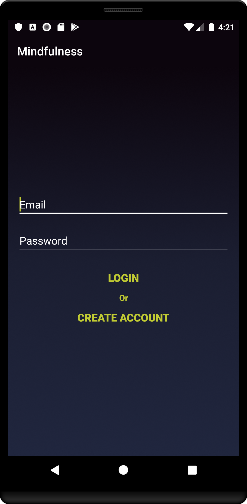
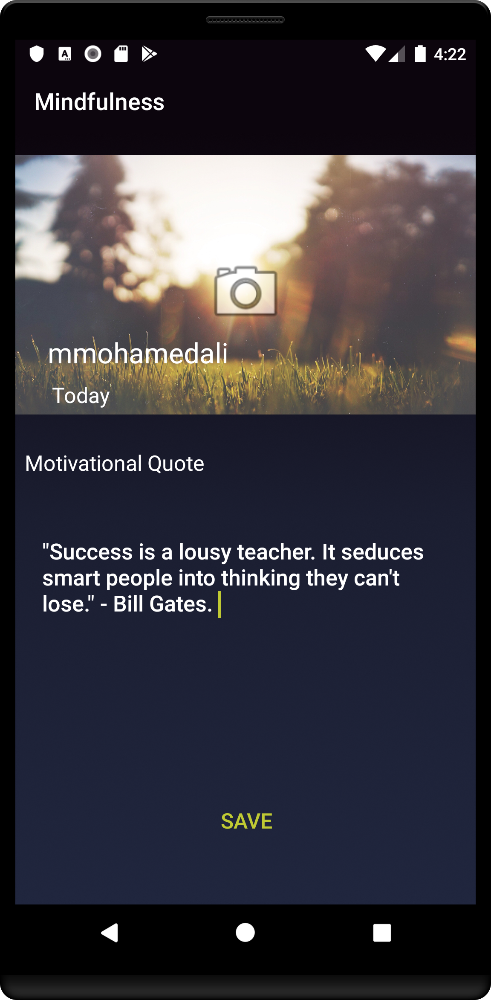

# Mindfulness
A journal app that allows users to write their thoughts and what they are grateful for throughout the day. 

        

### Setup development environment

* [Android Studio](http://developer.android.com/intl/es/sdk/index.html)

* [Android SDK Tools](http://developer.android.com/intl/es/sdk/index.html#Other)

* [Android NDK](http://developer.android.com/intl/es/ndk/downloads/index.html)

### Build & Run the application

* Get the source code

```
git clone https://github.com/mmohamedali/Mindfulness
```

* Configure the variable `NDK_ROOT` to point to your Android NDK installation path at `jni/build.sh`.

* Open the project with Android Studio, let it build the project and hit _*Run*_
